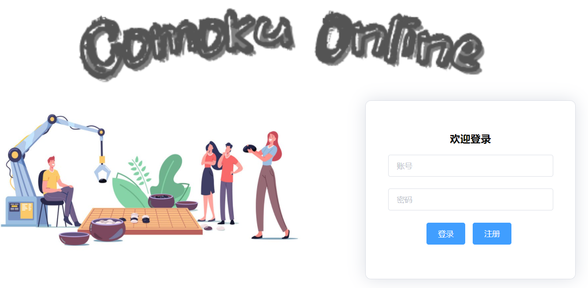
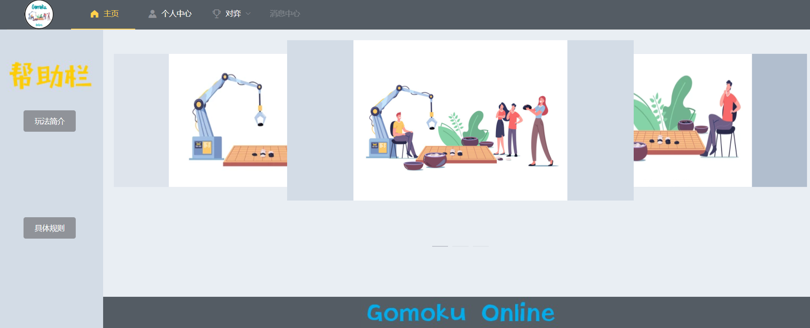
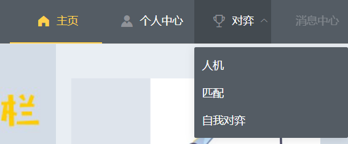
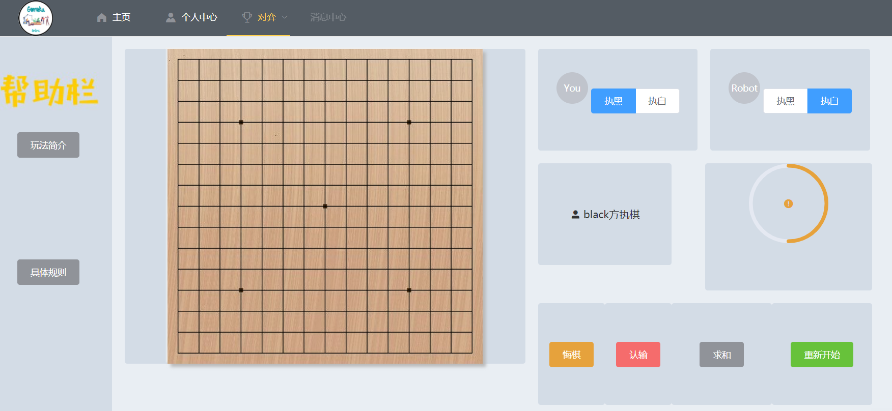

# 项目简介
**Gomoku-Online** 五子棋在线对弈平台，只支持无禁手规则

提供如下功能：
* 摆棋谱
* 人机对弈
* 在线匹配

其中在线匹配提供如下功能：
1. 大厅聊天
2. 房主创建房间
3. 挑战房主或旁观
4. 房间聊天
5. 开始游戏
6. 下棋、悔棋、投降、求和
7. 游戏结束
8. 退出房间

一个玩家可同时进行或旁观多场游戏


## 注册与登录

<br>

登录后进入平台


<br>

左边是帮助栏，提示玩法简介与具体规则



<br>

在主菜单可以选择功能


<br>

人机与匹配点击开始游戏以后会进入相关页面

可以选择先后手，并且具有如下几个功能：
* 悔棋
* 认输
* 求和
* 重新开始


# 搭建
## 技术栈
采用前后端分离技术，通信方面采用了 **websocket** 技术栈

前端采用 **vue** 框架搭建，需要 **npm** 与 **nodejs** 环境

> npm -v 7.9.0
> node -v 14.16.1
> vue -v 2.6.12

本项目使用了 vue 的脚手架 **@vue/cli**

不过使用的是 2.x 版本的 `vue init webpack` 命令建立的

排版等主要结合了 **Element-UI** 组件库
> Element，一套为开发者、设计师和产品经理准备的
> 基于 Vue 2.0 的桌面端组件库

本项目主要的 npm 安装包与其对应版本如下：
```git
├── axios@0.21.1
├── element-ui@2.15.1
├── node-sass@4.14.1
├── sass-loader@7.3.1
├── vue-i18n@8.24.3
├── vue-router@3.5.1
├── vue-style-loader@3.1.2
├── vue-template-compiler@2.6.12
├── vue@2.6.12
├── vuex@3.6.2
└── webpack@3.12.0
```

主要需要注意的是`sass-loader`与`node-sass`，这两个包版本过高会有不兼容之类的问题
```git
npm install sass-loader@7.3.1 node-sass@4.14.1 --save-dev
```

## 项目搭建流程
```git
vue init webpack Gomoku-Online
cd Gomoku-Online
npm install vue-router --save-dev
npm install sass-loader@7.3.1 node-sass@4.14.1 --save-dev
npm i element-ui -S
npm install
npm run dev
```

## 整合功能
1. element-ui：页面布局、按钮等组件
2. vue-router：管理路由
3. axios：与后端进行 http 通信
4. vue-i18n：国际化
5. canvas：棋子与棋盘的绘制
6. vuex：存储数据传输对象
7. websocket：与后端进行 ws 通信

## 项目结构
```
│  index.html
│  package-lock.json
│  package.json
│  README.md
│  vue.config.js
│              
├─config    
├─src
│  │  App.vue
│  │  main.js
│  │  
│  ├─assets
│  │  ├─css
│  │  ├─img
│  │  └─theme
│  ├─common
│  │  │  color.js
│  │  │  msgCode.js
│  │  │  
│  │  └─lang
│  ├─components
│  ├─network
│  ├─router
│  ├─store
│  └─views
│      └─nested
│              
└─static
    │  .gitkeep
    │  favicon.ico
```


## Build Setup

``` bash
# install dependencies
npm install

# serve with hot reload at localhost:8080
npm run dev

# build for production with minification
npm run build

# build for production and view the bundle analyzer report
npm run build --report
```

For a detailed explanation on how things work, check out the [guide](http://vuejs-templates.github.io/webpack/) and [docs for vue-loader](http://vuejs.github.io/vue-loader).


# 备注
**Websocket**部分参考了[https://github.com/AnizOoalGown/Gobang-Online](https://github.com/AnizOoalGown/Gobang-Online)的内容

不过与后端的通信过程 Bug 尚未修复

参考内容：
* `src/network/receiveAPI.js`
* `src/network/sendAPI.js`
* `src/network/websocket.js`
* `src/store`

